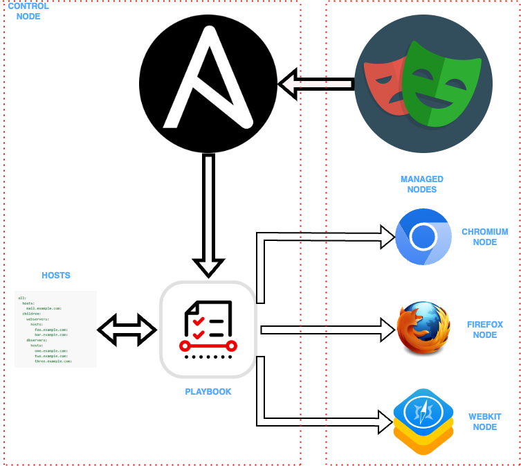

# Cross Browser and Device Testing with Ansible and Playwright

This project is designed to run cross-browser and device tests written in Playwright with Java, using an Ansible playbook to execute them across different browsers and devices. The setup allows automatic deployment and execution of tests on various environments.



## Project Structure

- **Java & Playwright**: Playwright is a testing automation tool that supports multiple browsers (Chrome, Firefox, Webkit) for writing and running tests. In this project, the Java version of Playwright is used.

- **Maven**: Maven is used for managing project dependencies and running tests.

- **Ansible**: Ansible is an automation tool used to deploy and manage tests across distributed systems. Here, it helps to run cross-browser and device tests across different environments using playbooks.

## Requirements

- Java 17 or higher
- Maven 3.x
- Ansible 2.x
- Playwright version 1.4x.x or higher
- SSH access to target devices for Ansible

## Installation Steps

1. **Clone the repository**:
   ```bash
   git clone https://github.com/YasinDeger48/cross-browser-ansible.git
   cd cross-browser-ansible

2. **Install Maven dependencies:**:
   ```bash
   mvn clean install

3. **Install Playwright dependencies:**:
   ```bash
   mvn exec:java -e -Dexec.mainClass=com.microsoft.playwright.CLI -Dexec.args="install"

4. **Run the Ansible Playbook:**:
   ```bash
   ansible-playbook -i inventory.ini playbook.yml

## Ansible Configuration
  **inventory.ini:** Contains the IP addresses and user information for the machines where tests will be run.
  
```bash
[all]
server1 ansible_host=192.168.64.24
server2 ansible_host=192.168.64.25
server3 ansible_host=192.168.1.11 ansible_user=yasindeger
```


## Browser and Device Testing
Playwright supports testing browsers at different device sizes and resolutions. You can configure Playwright to run tests on different browsers and devices.

**Example Playwright configuration:**
  
```bash
String browserType = Optional.ofNullable(System.getProperty("webdriver.browser"))
        .filter(b -> !b.isEmpty())
        .orElse("chromium");


        playwright = Playwright.create();

        switch (browserType) {
            case "chromium":
                browser = playwright.chromium().launch();
                break;
            case "firefox":
                browser = playwright.firefox().launch();
                break;
            case "webkit":
                browser = playwright.webkit().launch();
                break;
            default:
                throw new IllegalArgumentException("Unsupported Browser: " + browserType);
        }

        page = browser.newPage(); 
```
## Running Tests
To run the tests locally, use Maven commands:

```bash
mvn test
```
If you want to run the tests remotely using Ansible, run the Ansible playbook:

```bash
ansible-playbook -i inventory.ini playbook.yml
```

## Contribution
If you'd like to contribute to this project, please fork the repository and implement your changes before opening a pull request.


